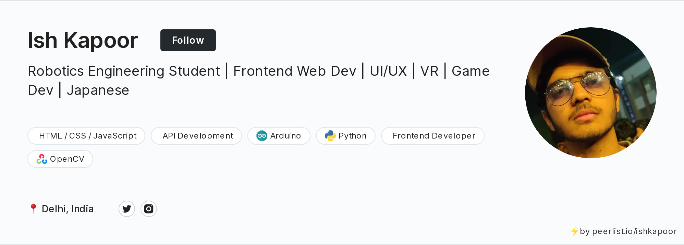

### Hi there 

<!--
**ishkapoor2000/ishkapoor2000** is a ✨ _special_ ✨ repository because its `README.md` (this file) appears on your GitHub profile.

Here are some ideas to get you started:

- 🔭 I’m currently working on ...
- 🌱 I’m currently learning ...
- 🤔 I’m looking for help with ...
- 💬 Ask me about ...
- 📫 How to reach me: ...
- 😄 Pronouns: ...
- ⚡ Fun fact: ...
-->

<h3 align="center">I am Ish Kapoor</h3>
<h3 align="center">A passionate PM from India
  
     
  
</h3>

  

- 🔭 Product Guy @ <a href="https://www.redcliffelabs.com/" alt="https://www.redcliffelabs.com/" />Redcliffelabs</a>.
- 💬 You can ask me about Product Management, Game Dev, 3D, AR, VR, Web development & AI/Deep Learning.
- 🌐 Working on Chai Sutta Explorer: <a href="https://github.com/ishkapoor2000/chai-sutta-explorer">Repo</a> - A VS Code Extension to find and handle all of your API calls.
- 🌱 I’m currently learning ThreeJS, WebXR, PM, PHP, API development, system architecture, microservices.
- 🎮 Play _**Dark Corner**_ & _**Dark Corner: v2 Mobile**_ at my [**itch.io page**](https://ishkapoor.itch.io).
- 📫 How to reach me: <a href="https://topmate.io/ish" rel="noopener" target="_blank">Connect with me</a>.

 

  

<!-- <h3 id="connect-with-me" align="left">Connect with me:</h3>

  
  
  
  <a href="mailto:ishkapoor2000@gmail.com?'Reching out to you'='Hi, I want to enquire about...'" rel="noopener" target="_blank"></fa>
  

 -->

<h3 align="left">Languages and Tools:</h3>

                

&nbsp;

## Spotify Playing 🎧

# My Recent Activity on GitHub
<!--START_SECTION:activity-->
1. 🎉 Merged PR [#5](https://github.com/ishkapoor2000/FIRE_FIGHTING_AUTOMATED_ROBOT/pull/5) in [ishkapoor2000/FIRE_FIGHTING_AUTOMATED_ROBOT](https://github.com/ishkapoor2000/FIRE_FIGHTING_AUTOMATED_ROBOT)
2. 🎉 Merged PR [#1](https://github.com/ishkapoor2000/qr-code-component-main/pull/1) in [ishkapoor2000/qr-code-component-main](https://github.com/ishkapoor2000/qr-code-component-main)
3. 💪 Opened PR [#1](https://github.com/ishkapoor2000/qr-code-component-main/pull/1) in [ishkapoor2000/qr-code-component-main](https://github.com/ishkapoor2000/qr-code-component-main)
4. 🗣 Commented on [#99](https://github.com/draftbit/twitter-lite/issues/99) in [draftbit/twitter-lite](https://github.com/draftbit/twitter-lite)
5. 🗣 Commented on [#124](https://github.com/draftbit/twitter-lite/issues/124) in [draftbit/twitter-lite](https://github.com/draftbit/twitter-lite)
<!--END_SECTION:activity-->

  

